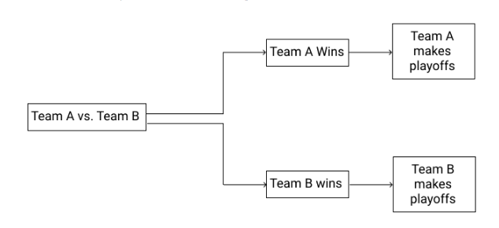
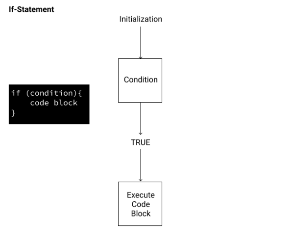
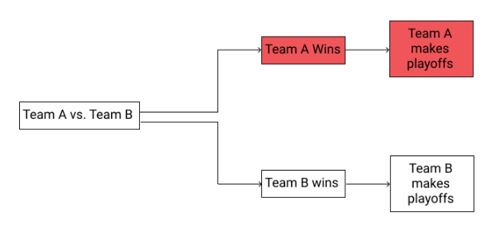
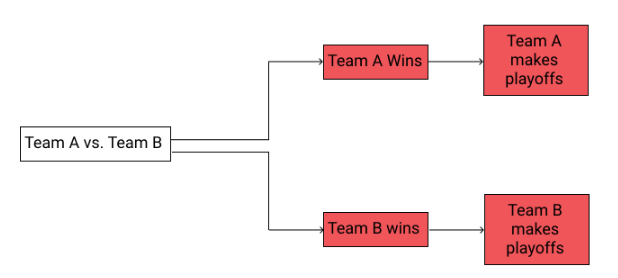
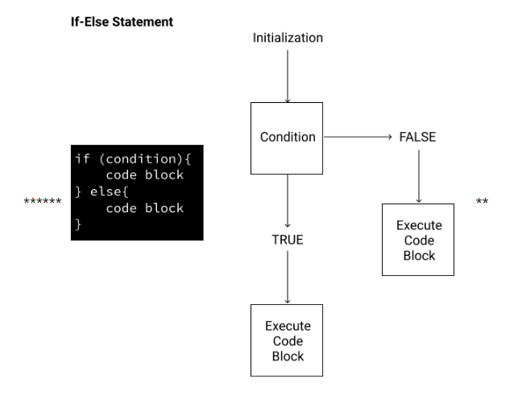
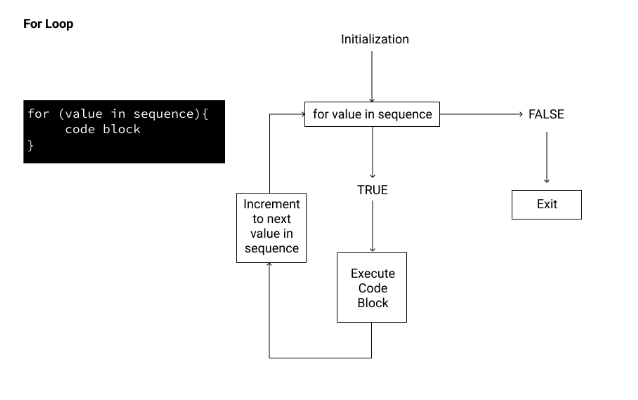
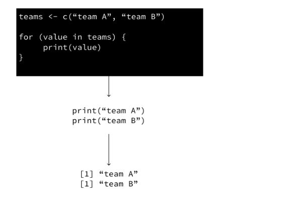

```{r setup, include=FALSE}
knitr::opts_chunk$set(echo = TRUE)
```

# Traducido de dataquest.io

# Cómo usar if-else y loops en R

Cuando programamos en R (o cualquier otro lenguaje, para el caso), a menudo queremos controlar cuándo y cómo se ejecutan partes particulares de nuestro código. Podemos hacer eso usando estructuras de control como declaraciones if-else, loops for y loops while.

Las estructuras de control son bloques de código que determinan cómo se ejecutan otras secciones de código en función de parámetros especificados. Puede pensar en estos como en un poco como las instrucciones que un padre podría darle a su hijo antes de salir de la casa:

"Si no estoy en casa a las 8:00 p. M., Prepárate la cena".

Las estructuras de control establecen una condición y le dicen a R qué hacer cuando esa condición se cumple o no. ¡Y a diferencia de algunos niños, R siempre hará lo que le digamos! Puede obtener más información sobre las estructuras de control en la documentación de R si lo desea. 

# Operadores de comparación en R
Para usar estructuras de control, necesitamos crear declaraciones que resulten ser VERDADERAS o FALSAS. En el ejemplo para niños anterior, la declaración "Son las 8 p.m. ¿Mis padres ya están en casa? produce VERDADERO ("Sí") o FALSO ("No"). En R, la forma más fundamental de evaluar algo como VERDADERO o FALSO es a través de operadores de comparación.

A continuación se muestran seis operadores de comparación esenciales para trabajar con estructuras de control en R:

== significa igualdad. La declaración x == a enmarcada como una pregunta significa "¿El valor de x es igual al valor de a?"
! = significa “no igual”. La declaración x == b significa "¿El valor de x no es igual al valor de b?"
<significa "menor que". La declaración x <c significa "¿Es el valor de x menor que el valor de c?"
<= significa "menor o igual que". La declaración x <= d significa "¿El valor de x es menor o igual que el valor de d?"
> significa "mayor que". La declaración x> e significa "¿Es el valor de x mayor que el valor de e?"
> = significa "mayor o igual que". La declaración x> = f significa "¿Es el valor de x mayor o igual que el valor de f?"

# Entendiendo If-Else en R
Supongamos que estamos viendo un partido deportivo que decide qué equipo llega a los playoffs. Podríamos visualizar los posibles resultados usando este gráfico de árbol:

```{r}

```


Como podemos ver en el diagrama de árbol, solo hay dos resultados posibles. Si el equipo A gana, pasa a los playoffs. Si el equipo B gana, entonces se van.

Comencemos por intentar representar este escenario en R. Podemos usar una declaración if para escribir un programa que imprima el equipo ganador.

Las sentencias If le dicen a R que ejecute una línea de código si una condición devuelve VERDADERA. Una declaración if es una buena opción aquí porque nos permite controlar qué declaración se imprime dependiendo del resultado que se produzca.

La siguiente figura muestra un diagrama de flujo condicional y la sintaxis básica de una declaración if:

```{r}

```

La condición de nuestra declaración if debe ser una expresión que se evalúe como VERDADERO o FALSO. Si la expresión devuelve VERDADERO, el programa ejecutará todo el código entre corchetes {}. Si es FALSE, no se ejecutará ningún código.

Sabiendo esto, veamos un ejemplo de una declaración if que imprime el nombre del equipo que ganó.
```{r}
team_a <- 3 #número de goles marcados por el equipo A
team_b <- 1 #número de goles marcados por el equipo B
if(team_a > team_b) {print("Team A Gana")}
```
Debido a que el equipo A tenía más goles que el equipo B, nuestra declaración condicional (equipo_A> equipo_B) se evalúa como VERDADERO, por lo que el bloque de código debajo se ejecuta, imprimiendo la noticia de que el equipo A ganó el partido.


# Agregar la instrucción else en R
En el ejercicio anterior, imprimimos el nombre del equipo que llegará a los playoffs en función de nuestra expresión. Veamos un nuevo emparejamiento de puntuaciones. ¿Qué pasa si el equipo A tiene 1 gol y el equipo B tiene 3 goles? Nuestro condicional team_A > team_B se evaluaría como FALSE. Como resultado, si ejecutamos nuestro código, no se imprimirá nada. Debido a que la instrucción if se evalúa como falsa, el bloque de código dentro de la instrucción if no se ejecuta:


```{r}
team_a <- 3 #número de goles marcados por el equipo A
team_b <- 1 #número de goles marcados por el equipo B
if(team_a > team_b){print("Team A llegará a los playoffs")}
```

Si volvemos a nuestro diagrama de flujo original, podemos ver que solo hemos codificado una rama para una de las dos posibilidades:

```{r}

```


Idealmente, nos gustaría hacer que nuestro programa tenga en cuenta ambas posibilidades y "El equipo B llegará a los playoffs" si la expresión se evalúa como FALSO. En otras palabras, queremos poder manejar ambas ramas condicionales:

```{r}

```

#if else
Para hacer esto, agregaremos una declaración else para convertir esto en lo que a menudo se llama una declaración if-else. En R, una declaración if-else le dice al programa que ejecute un bloque de código si la declaración condicional es VERDADERA, y un bloque de código diferente si es FALSO. A continuación, se muestra una representación visual de cómo funciona esto, tanto en forma de diagrama de flujo como en términos de la sintaxis de R:


```{r}

```


# Para generalizar, if-else en R necesita tres argumentos:

* Una declaración (por ejemplo, operador de comparación) que se evalúa como VERDADERO o FALSO.
* El valor que debe devolver R si el operador de comparación es VERDADERO.
* Valor que debe devolver R si el operador de comparación es FALSO.

- Entonces, para nuestro ejemplo, necesitamos agregar un bloque de código que se ejecute si nuestra expresión condicional team_A> team_B devuelve FALSE. Podemos hacer esto agregando una declaración else en R. Si nuestro operador de comparación evalúa como FALSO, imprimamos "El equipo B llegará a los playoffs".

```{r}
team_a <- 3 #número de goles marcados por el equipo A
team_b <- 1 #número de goles marcados por el equipo B
if (team_a > team_b){
    print ("Team A will make the playoffs")
} else {
    print ("Team B will make the playoffs")
}

```

# Moviéndose más allá de dos ramas

Hasta ahora, hemos trabajado bajo el supuesto de que cada una de las decisiones en nuestra estructura de control tenía solo dos ramas: una correspondiente a VERDADERO y otra a FALSO. Hay muchas ocasiones en las que tenemos más de dos, ya que algunas decisiones no se reducen a un "Sí" frente a un "No".

Supongamos, por un momento, que estamos viendo un partido deportivo que puede terminar en empate. La estructura de control de nuestro último ejemplo no tiene en cuenta esto. Afortunadamente, R proporciona una forma de incorporar más de dos ramas en una instrucción if con la palabra clave else if. La palabra clave else if proporciona otro bloque de código para usar en una declaración if, y podemos tener tantos como consideremos adecuados. Así es como se vería esto:

```{r}
team_A <- 2 # Number of goals scored by Team A
team_B <- 2# Number of goals scored by Team B
if (team_A > team_B){
  print ("Team A won")
} else if (team_A < team_B){
  print ("Team B won")
} else {
  "Team A & B tied"
}
```

Cada resultado potencial del juego tiene su propia rama. El bloque de código else ayuda a cubrirnos de cualquier situación en la que haya un empate.


# Usando el loop for en R
Ahora que hemos usado if-else en R para mostrar los resultados de una coincidencia, ¿qué pasaría si quisiéramos encontrar los resultados de varias coincidencias? Supongamos que tenemos una lista de vectores que contiene los resultados de nuestra coincidencia: coincidencias <- lista (c (2,1), c (5,2), c (6,3)).

Tenga en cuenta que tendremos que usar [[]] al indexar, ya que queremos devolver un solo valor dentro de cada lista en nuestra lista, no el valor con el objeto de lista. La indexación con [] devolverá un objeto de lista, no el valor.

Entonces, por ejemplo, en el código que tenemos arriba, coincidencias [[2]] [1] está llamando al primer índice de la segunda lista (es decir, la puntuación del Equipo A en el Juego 2).

Suponiendo que las metas del Equipo A se enumeran primero (el primer índice del vector) y las del Equipo B son las segundas, podríamos encontrar los resultados usando if-else en R así:


```{r}
if (matches[[1]][1] > matches[[1]][2]){
    print ("Win")
} else {
    print ("Loss")
}

if (matches[[2]][1] > matches[[2]][2]){
   print ("Win")
} else {
    print ("Loss")
}

if (matches[[3]][1] > matches[[3]][2]){
   print ("Win")
} else {
   print ("Loss")
}
```

Este código funciona, pero si observamos este enfoque, es fácil ver un problema. Escribir esto para tres juegos ya es engorroso. ¿Y si tuviéramos una lista de 100 o 1000 juegos para evaluar?

Podemos mejorar nuestro código realizando la misma acción usando un loop for en R. Un loop for repite un fragmento de código varias veces para cada elemento dentro de un objeto. Esto nos permite escribir menos código (lo que significa menos posibilidad de errores) y puede expresar mejor nuestra intención. Aquí hay una representación de diagrama de flujo y la sintaxis en R (que se parece mucho a la sintaxis if).

```{r}



```

En este diagrama, para cada valor de la secuencia, el loop ejecutará el bloque de código. Cuando no queden más valores en la secuencia, esto devolverá FALSE y saldrá del ciclo.

Analicemos lo que está pasando aquí.

- secuencia: este es un conjunto de objetos. Por ejemplo, este podría ser un vector de números c (1,2,3,4,5).
- valor: esta es una variable de iterador que usa para hacer referencia a cada valor en la secuencia. Consulte las convenciones de nomenclatura de variables en el primer curso para conocer los nombres de variables válidos.
- bloque de código: esta es la expresión que se evalúa.
Veamos un ejemplo concreto. Escribiremos un ciclo rápido que imprima el valor de los elementos en una lista y crearemos una lista corta con dos elementos: Equipo A y Equipo B. 


```{r}
teams <- c("team_A","team_B")
for (value in teams){
    print(value)
}
```


Una vez que el ciclo muestra el resultado de la primera iteración, el ciclo buscará el siguiente valor en la posición. Como resultado, pasará por otra iteración. Dado que no hay más valores en la secuencia, el ciclo saldrá después de "team_B".

# Rompiendo el loop for en R
Ahora que hemos agregado una instrucción if-else, veamos cómo detener un loop for en R en función de una determinada condición. En nuestro caso, podemos usar una declaración de interrupción para detener el ciclo tan pronto como veamos que el equipo A ha ganado un juego.

Usando el ciclo for que escribimos arriba, podemos insertar la declaración break dentro de nuestra declaración if-else.


```{r}
matches <- list(c(2,1),c(5,2),c(6,3))
for (match in matches){
    if (match[1] > match[2]){
        print("Win")
        break
    } else {
        print("Lose")
    }
}
```


# Usando un loop while en R
En el ejercicio anterior, usamos un loop for en R para repetir un fragmento de código que nos dio el resultado de la coincidencia. Ahora que hemos devuelto los resultados de cada partido, ¿qué pasaría si quisiéramos contar el número de victorias para determinar si llegan a los playoffs? Un método para devolver los resultados de los primeros cuatro juegos es usar un loop while en R.

Un ciclo while en R es un primo cercano del ciclo for en R. Sin embargo, un ciclo while comprobará una condición lógica y seguirá ejecutando el ciclo siempre que la condición sea verdadera. Así es como se ve la sintaxis de un loop while

```{r}

```

Si la condición en el ciclo while en R siempre es verdadera, el ciclo while será un ciclo infinito y nuestro programa nunca dejará de ejecutarse. ¡Esto es algo que definitivamente queremos evitar! Al escribir un ciclo while en R, queremos asegurarnos de que en algún momento la condición sea falsa para que el ciclo deje de ejecutarse.

Tomemos un equipo que está comenzando la temporada con cero victorias. Necesitarán ganar 10 partidos para llegar a los playoffs. Podemos escribir un loop while para decirnos si el equipo llega a los playoffs:

```{r}
wins <- 0
while (wins < 10){
    print ("Does not make playoffs")
    wins <- wins + 1
}
```

Nuestro ciclo dejará de ejecutarse cuando las ganancias lleguen a 10. Observe que continuamente agregamos 1 al total de ganancias, por lo que eventualmente, la condición de ganancia <10 devolverá FALSO. Como resultado, el loop sale.

No se preocupe si todo este proceso parece abrumador, mientras que los loops en R requieren tiempo para comprenderlos, pero son herramientas poderosas una vez que se dominan. Hay muchas variables diferentes para hacer malabares, pero la clave para comprender el ciclo while es saber cómo cambian estas variables cada vez que se ejecuta el ciclo.

¡Escribamos nuestro primer ciclo while en R, contando las victorias del equipo A!

# Usando una instrucción if-else dentro de un loop while en R
Ahora que imprimimos el estado del equipo cuando no tiene suficientes victorias, agregaremos una función que indica cuándo llegará a los playoffs.

Para hacer esto, necesitaremos agregar una instrucción if-else en nuestro ciclo while. Agregar una instrucción if-else en un ciclo while es lo mismo que agregarlo a un ciclo for en R, lo cual ya hemos hecho. Volviendo a nuestro escenario donde 10 victorias le permite al Equipo A llegar a los playoffs, agreguemos un condicional si-si no.

```{r}
wins <- 0
while (wins <= 10){
    if (wins < 10){
        print("does not make playoffs")
    } else {
        print ("makes playoffs")
    }
    wins <- wins + 1
}
```

El condicional if-else irá entre los corchetes del loop while, en el mismo lugar que lo pusimos en el loop for anteriormente.


# Rompiendo el loop while en R
Digamos que el número máximo de victorias que un equipo puede tener en una temporada es 15. Para llegar a los playoffs, todavía necesitaremos 10 victorias, por lo que podemos terminar nuestro ciclo tan pronto como el Equipo A alcance este número.

Para hacer esto, podemos usar otra declaración de ruptura. Nuevamente, esto funciona de la misma manera en un ciclo while que en un ciclo for; una vez que se cumple la condición y se ejecuta la ruptura, el ciclo finaliza.

```{r}
wins <- 0
playoffs <- c()
while (wins <= 15){
    if (wins < 10){
        print("does not make playoffs")
        playoffs <- c(playoffs, "does not make playoffs")
    } else {
        print ("makes playoffs")
        playoffs <- c(playoffs, "makes playoffs")
        break
    }
    wins <- wins + 1
}
```


# Intuición detrás del loop while
El ciclo for en R es el ciclo con el que probablemente lidiarás con más frecuencia. Pero es útil conocer el ciclo while.

Para distinguir entre estos dos tipos de loops, es útil pensar en un loop for como si se tratara de una lista de tareas. La idea es que tengas una cantidad determinada de tareas para terminar y, una vez que hayas hecho todas tus tareas, habrás terminado. La clave aquí es que hay una cantidad determinada de elementos que necesitamos recorrer en un loop for.

Por otro lado, un ciclo temporal es como intentar alcanzar un hito, como recaudar una cantidad objetivo de dinero para un evento benéfico. Para los eventos de caridad, normalmente realiza y hace cosas para recaudar dinero para su causa, como correr vueltas o brindar servicios a las personas. Realiza estas tareas hasta que alcanzas tu objetivo y no está claro desde el principio cuántas tareas debes realizar para alcanzar el objetivo. Esa es la idea clave detrás de un ciclo while: repita algunas acciones (léase: un fragmento de código) hasta que se cumpla una condición u objetivo. 
